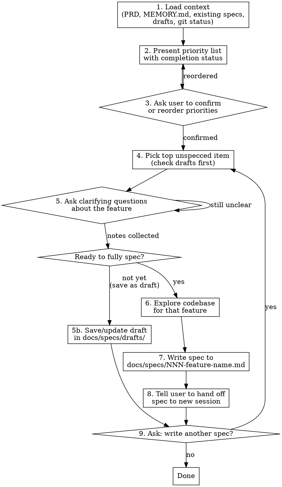

# Next Steps — Feature Planning & Spec Writing

Plan features, confirm priorities, collect draft notes, write self-contained specs, hand off to fresh sessions.

## Workflow



## Step Details

### 1. Load Context

Read these files (skip any that don't exist):
- `docs/prd/PRD.md` — Section 12 (Feature Prioritization) for the canonical feature list
- Project MEMORY.md — what's already been built
- `CLAUDE.md` — coding conventions and architecture
- `docs/specs/*.md` — specs already written (to avoid duplicates)
- `git log --oneline -20` — recent work

**Finding the agreed priority list:** The user-confirmed priority list lives in
`docs/specs/PRIORITIES.md`, NOT in the PRD. The PRD has its own feature list
(Section 12), but the user may have reordered or added items that differ from
the PRD. **Always prefer `PRIORITIES.md` over the PRD when they conflict.**
Update `PRIORITIES.md` whenever the user reorders or adds items.

**Check for drafts:** Also read `docs/specs/drafts/*.md` to find features with
existing notes. When a draft exists for the feature being specced, use its
notes as the starting point for Step 5 instead of asking from scratch.

### 2. Present Priority List

Build a table comparing PRD features against what exists:

```
| # | Feature | PRD Ref | Status |
|---|---------|---------|--------|
| 1 | Player CRUD | FR-021 | Not started |
| 2 | Bulk status updates | FR-022 | Not started |
| 3 | Correction submission | FR-025 | Schema only |
| ...
```

**Status values:** Done, Partial (explain), Schema only, Not started, Specced (link), Draft (link)

### 3. Confirm Priorities

Use AskUserQuestion to ask:

> "Here's the current priority list. Want to change the order, add items, or remove any before we start writing specs?"

If the user reorders, update the list and re-present. Once confirmed, proceed.

### 4. Pick Top Unspecced Item

Select the highest-priority item that doesn't already have a spec in `docs/specs/`.

### 5. Clarify the Feature with the User

**MANDATORY — do NOT skip this step.** Before exploring code or writing anything, you must understand exactly what the user wants. Ask clarifying questions using AskUserQuestion or direct conversation.

**What to clarify:**
- **User-facing behavior:** What does the user see and do? Walk through the interaction step by step.
- **Scope boundaries:** What is explicitly included vs. excluded? What's the simplest version?
- **Data flow:** Where does the data come from? What happens when the user takes an action?
- **Edge cases:** What happens with empty states, errors, or unusual data?
- **Visual placement:** Where does this go in the UI? What's it near? What's it below/above?
- **Terminology:** If the user used domain-specific words, confirm you understand them the same way.

**How to ask:**
- Summarize your understanding of the feature in 2-3 sentences.
- Then ask specific questions about anything you're unsure of or that could go multiple ways.
- Keep asking until you and the user agree on what the feature does. Don't assume — confirm.

**Final check — ALWAYS ask this after your clarifying questions are answered:**

> "Is there anything else you want to add or change about this feature before I write the spec?"

Wait for the user's response. If they add more details, incorporate them. Only proceed to exploration once they confirm there's nothing else.

**When to stop asking:**
- You've asked your clarifying questions AND the final "anything else?" question.
- You can describe the feature's behavior precisely enough that someone else could build it.
- The user says "that's right" or confirms your summary.

### 5b. Save as Draft (when not ready to fully spec)

If the user has notes but isn't ready to commit to a full spec — they're still
thinking, have partial ideas, or want to collect notes over multiple sessions —
save the notes as a draft instead of forcing the full spec template.

**When to use drafts:**
- User says things like "I'm not sure yet", "let me think about it", "just
  save these notes for now"
- The feature discussion is incomplete — key questions are still open
- User wants to jot down ideas and come back later

**Draft file format:** `docs/specs/drafts/<feature-name>.md`

```markdown
# Draft: [Feature Name]

**Status:** Draft — collecting notes
**Created:** YYYY-MM-DD
**Last updated:** YYYY-MM-DD

## Notes

[Bullet points of everything the user has said about this feature,
organized by topic. Keep the user's language — don't over-formalize.]

## Open Questions

[Questions that still need answers before this can become a full spec.
These come from Step 5 clarifying questions that weren't answered yet.]
```

**After saving a draft:**
1. Add or update the entry in `PRIORITIES.md` with status `Draft` and a link
   to the draft file
2. Tell the user the draft is saved and they can add more notes anytime by
   saying something like "add to the player detail form draft"
3. When the user later says "spec the player detail form" or similar, load
   the draft notes as the starting point for Step 5 — don't re-ask questions
   that are already answered in the draft

**Appending to an existing draft:**
If a draft already exists for the feature, read it first, then append the
new notes under the existing ones with a date header:

```markdown
### Added YYYY-MM-DD
- [new notes]
```

### 6–7. Explore and Write the Spec

Once the feature is fully understood:

1. **Explore the codebase** — read every file the feature will touch. Understand current patterns, data flow, component structure.
2. **Write the spec** to `docs/specs/NNN-feature-name.md` using the template below.
3. **Spec number = priority number.** The spec file number MUST match the
   feature's `#` in `PRIORITIES.md`. For example, priority #24 becomes
   `024-feature-name.md`. This keeps specs and priorities in sync.
4. **Check for collisions before writing.** Before creating a spec file,
   verify no existing spec already uses that number by checking
   `docs/specs/NNN-*.md`. If a collision exists:
   - **Warn the user:** "Spec 024 already exists (`024-other-feature.md`).
     Should I push the other items down (renumber 024→025, 025→026, etc.)
     or assign a different number?"
   - **Default suggestion:** Push other items down — renumber both the spec
     files and the `PRIORITIES.md` entries to make room.
   - **Never silently overwrite or skip.** Always confirm with the user.

### 8. Hand Off

Tell the user:

> "Spec written to `docs/specs/NNN-feature-name.md`. Start a new Claude Code session and tell it: **Read and implement `docs/specs/NNN-feature-name.md`. After implementing, run every test in the Playwright Test Plan section — do not skip any.** That file has everything it needs."

### 9. Loop

Ask:

> "Want to write the spec for the next item — [name of next priority]?"

If yes, go to step 4 for the next unspecced item. If no, stop.

## Spec Template

Every spec written by this skill MUST follow this structure:

```markdown
# Spec NNN: [Feature Name]

**PRD Reference:** FR-XXX
**Priority:** Must Have | Should Have | Nice to Have
**Depends on:** (other spec numbers, or "None")

## What This Feature Does

[2-3 sentences describing the user-facing behavior. Written for someone
who has never seen the codebase.]

## Current State

[What exists today that this feature builds on. Mention specific files,
database tables, and components. Use absolute paths from project root.]

## Changes Required

### Database
[New migrations, schema changes, or "No database changes needed"]

### Server Actions / API Routes
[New actions needed, with function signatures and what they do]

### Pages
[New pages or modifications to existing pages. Specify route paths.]

### Components
[New or modified components. Describe props and behavior.]

### Styles
[New CSS classes needed in globals.css, following the @apply convention]

## Key Implementation Details

[Anything non-obvious: RLS policy implications, edge cases, patterns to
follow from existing code. Reference specific files for patterns to copy.]

## Acceptance Criteria

- [ ] [Specific, testable criterion]
- [ ] [Another criterion]
- [ ] Build passes (`npm run build`)
- [ ] No lint errors (`npm run lint`)

## Playwright Test Plan

Step-by-step browser tests to verify every variation of this feature.
Each test should be runnable via the Playwright MCP browser tools
(navigate, snapshot, click, type, etc.) by a Claude Code session.

**Screenshot Directory:**
All screenshots taken during testing MUST be saved to
`docs/specs/temp-testing-screenshots/`. Never save screenshots to the
repo root or any other location. This directory is for ephemeral test
artifacts only — clean it up after testing is complete.

**CRITICAL — Testing Association:**
All write tests MUST use the **Test / Sandbox association**
(`a2000000-0000-0000-0000-000000000002`). NEVER run write
operations against NGHA (Nepean Wildcats) or any other live
association during testing. Switch to the TEST association in
the app before running any write test. Read-only tests
(navigate, snapshot, verify UI) may use a live association.
If the sandbox lacks required test data, set it up there
first — do NOT modify live data as a shortcut.

**Live Data Safety:**
Tests run against the real database. You MUST follow these
rules:

1. **Prefer read-only tests.** Verify by navigating and taking
   snapshots — do not modify data unless the test absolutely
   requires it.
2. **All write tests use the TEST / Sandbox association.**
   Switch to it before any mutation. Never write to NGHA or
   other live associations.
3. **When a test MUST write data** (e.g., heart a player, submit
   a form, change a name/number), log every mutation in a
   "Test Mutations" list at the end of this section.
4. **Revert all test mutations after testing.** After all tests
   pass, undo every write operation listed in "Test Mutations"
   (e.g., un-heart the player, restore the original name).
5. **Confirm with the user.** Before finishing, present the list
   of any remaining data changes and ask the user to verify
   everything was restored correctly.
6. **Never delete real player records or change real player
   statuses during testing.** If you need a specific data state
   (e.g., a "cut" player, a "made_team" player), verify it
   exists rather than creating it by modifying real records.

**Setup:** [Any preconditions — seed data, login steps, navigation to
the right page. Be explicit about the starting URL and user role.]

### Test 1: [Short description of what is being verified]
1. [Step — e.g., "Navigate to /teams"]
2. [Step — e.g., "Click the 'Previous Teams' toggle"]
3. **Verify:** [What to check — e.g., "Players are grouped by previous
   team, sorted F → D → G within each group"]

### Test 2: [Short description]
1. [Step]
2. [Step]
3. **Verify:** [Expected result]

[Continue for every meaningful variation. Cover:]
- [ ] **Happy path** — the main flow works end to end
- [ ] **Empty state** — what shows when there's no data
- [ ] **Error state** — what happens when an action fails
- [ ] **Boundary cases** — max values, min values, edge inputs
- [ ] **Role variations** — does it behave differently for member vs.
      group admin vs. admin? Test each role that interacts with the feature.
- [ ] **Mobile vs. desktop** — if the layout changes, test both viewports
- [ ] **Persistence** — if state is saved, reload the page and verify
      it was restored
- [ ] **Interaction combos** — if multiple actions can be combined
      (e.g., filter + search + sort), test them together

**Goal:** After running every test above, there should be zero need
for manual QA. If a scenario isn't covered here, it won't be caught.

### Test Mutations Log

[List every write operation performed during testing. For each, note
what was changed and how to revert it. Example:]

| Test | What Changed | How to Revert |
|------|-------------|---------------|
| Test 3 | Hearted player #42 (id: abc-123) | Un-heart via long-press menu |
| Test 7 | Set custom name "Johnny" on player #18 | Clear custom name field |

**After all tests pass, revert every mutation above and confirm with
the user that the data is clean.**

## Files to Touch

[Ordered list of every file that will be created or modified, so the
implementing agent can verify completeness]

## Implementation Checklist

After implementing the changes above, you MUST complete these steps
in order before claiming the work is done:

1. **Build:** Run `cd frontend && npm run build` — fix any errors.
2. **Lint:** Run `cd frontend && npm run lint` — fix any errors.
3. **Start dev server:** Run `cd frontend && npm run dev` to start
   the local dev server on port 3000.
4. **Run every Playwright test above.** Open the browser, follow
   each test's steps exactly, and verify each expected result using
   browser snapshots. If a test fails, fix the code and re-run it.
5. **Do not skip any test.** Every test in the Playwright Test Plan
   must pass before this spec is considered complete.
6. **Revert all test mutations.** Check the Test Mutations Log and
   undo every data change made during testing (un-heart players,
   restore names, delete test records, etc.). Confirm with the
   user that all test data has been cleaned up.
```

## Rules

- **One spec per feature.** Don't combine unrelated features.
- **Specs are self-contained.** A cold Claude Code session with only CLAUDE.md and the spec should be able to implement it.
- **Reference real file paths.** Don't say "the player component" — say `frontend/components/players/player-list.tsx`.
- **Include the Current State section.** This is the most important part. The implementing agent needs to know what already exists.
- **Don't write code in specs.** Describe behavior and structure. The implementing agent writes the code.
- **Create `docs/specs/` if it doesn't exist.**
